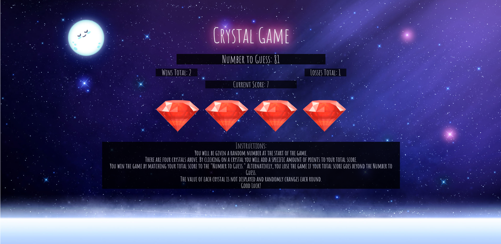

# Crystal Game

## Deployed Link to Project - (https://philliplaub.github.io/Crystal-Game/)

## What the project does
* Follow the intructions listed on the page. The Crystal game picks a random number in range for the "Number to Guess," as well as randomly assigns values that you cannot see for each of the four crystals. Goal is to click on each crystal adding points to your total, and try to hit the number to guess exactly without going over. The game features win and loss counters, and will reset after each win or loss.

## Why the project is useful

* This project is useful in getting to learn jquery. It helps with learning to generate specific random numbers in a range. Additional practice at building a counter system, start game functions, and also use of multiple elements such as addClass, attr, etc.

## How users can get started with the project

* Start by initial file creation, make your html, css, and js files, appropriate folders etc. Create basic format for your html, and link all of your files together. After ensuring that your files are working and linked, begin working on the game logic in your javascript. Create variables and arrays for needed, create Random numbers to assign to variables and a start game function. Make sure that you are updating the changes to your html. Then build a loop for creating your crystals and assigning appropriate attributes. Style with css when your game logic is complete.

## Where users can get help with your project

* Users can reference many other similar projects on github and stack overflow, as well as youtube. Good resources would be MDN and W3 schools, make sure you visit the jquery website as well. 

## Who maintains and contributes to the project

* This project is 100% maintained and contributed by Phillip Laub
